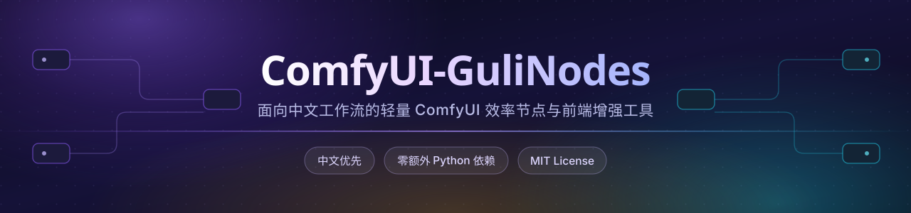

<p align="center">
  <picture>
    <source media="(prefers-color-scheme: dark)" srcset="assets/banner-dark.svg">
    <source media="(prefers-color-scheme: light)" srcset="assets/banner-light.svg">
    
  </picture>
</p>

<p align="center">
  <b>面向中文工作流的轻量 ComfyUI 效率节点与前端增强工具</b><br>
  <sub>画布整理 · 图像处理 · Latent 尺寸 · 文本输入 · 模型与 LoRA · 采样 · 视频 · 显存清理</sub>
</p>

<p align="center">
  <a href="https://github.com/guliacer/ComfyUI-GuliNodes"></a>
  <a href="https://github.com/guliacer/ComfyUI-GuliNodes/releases"></a>
  <a href="https://github.com/guliacer/ComfyUI-GuliNodes/blob/main/LICENSE"></a>
  
  
</p>

<p align="center">
  <a href="#特性亮点">特性亮点</a> ·
  <a href="#快速开始">快速开始</a> ·
  <a href="#主要能力">主要能力</a> ·
  <a href="#节点清单">节点清单</a> ·
  <a href="#依赖与兼容">依赖与兼容</a> ·
  <a href="#界面与设置">界面与设置</a> ·
  <a href="#常见问题">常见问题</a> ·
  <a href="#更新记录">更新记录</a> ·
  <a href="#致谢与借鉴说明">致谢与借鉴说明</a> ·
  <a href="#贡献">贡献</a> ·
  <a href="#许可证">许可证</a>
</p>

---

## 特性亮点

ComfyUI-GuliNodes 是一组面向中文工作流的轻量效率节点和前端增强工具，覆盖画布整理、文本输入、数值计算、图像处理、Latent 尺寸、模型/LoRA 管理、采样、视频处理、显存清理和网页 AI 辅助。**零额外 Python 依赖**，放进 `custom_nodes` 就能用。

| | 亮点 | 说明 |
| :--: | --- | --- |
| 🧩 | **参数按需显示** | 节点只展示当前选择下真正生效的输入与输出，不生效的参数直接隐藏，不做摆设。 |
| 🎨 | **画布增强** | 上色、对齐、等宽等高、自动间距、批量整理，分组可折叠为同名子工作流小节点。 |
| ⚡ | **轻量无依赖** | 只用 ComfyUI 环境自带的 `torch` / `PIL` / `numpy`，不引入 `cv2`、`kornia` 等重包。 |
| 🈶 | **中文优先** | 节点名、参数、选项、错误提示全中文，分类收敛为单级菜单，开箱即用。 |
| 🎬 | **视频与显存** | 视频加载 / 路径加载 / 合成 / 压缩 / 保存，模型与显存一键清理并输出报告。 |
| 🤖 | **AI 辅助** | 内置 Qwen Image 2.1 提示词增强与条件编码，支持内嵌网页 AI 平台反向读图。 |

---

## 快速开始

### 第 1 步 · 安装

| 方式 | 操作 |
| --- | --- |
| **ComfyUI Manager**（推荐） | 在 Manager 中搜索 `ComfyUI-GuliNodes`，点击 Install，然后重启 ComfyUI。 |
| **手动安装** | 在 `ComfyUI/custom_nodes` 下执行下面的命令。 |

```bash
cd ComfyUI/custom_nodes
git clone https://github.com/guliacer/ComfyUI-GuliNodes.git
cd ComfyUI-GuliNodes
pip install -r requirements.txt
```

> **说明**：`requirements.txt` 当前只是兼容声明，主插件没有额外 Python 包依赖。

### 第 2 步 · 重启 ComfyUI

重启后前端扩展会随插件自动加载。如果界面还是旧样子，请强制刷新浏览器（`Ctrl` + `F5`）。

### 第 3 步 · 开始使用

在画布空白处右键 → **新建节点** → 找到 **GG** 或 **GuliNodes** 分类，即可看到全部节点。

首次使用建议先打开 **设置 → GuliNodes**，或点击画布顶部的 **GuliNodes 工具** 按钮，看一眼各功能开关。

---

## 主要能力

### 画布与前端工具

- **顶部工具栏** — 节点/分组上色、取色粘贴、节点尺寸复制粘贴、对齐、等宽等高、自动间距、批量整理。
- **节点标题栏按钮** — 可分别开启「输入输出列表隐藏」与「节点折叠/恢复」按钮，状态随工作流持久化。
- **节点端口显示** — 隐藏端口只影响画布显示，不会断开已有连接，切换工作流或重开画布后继续保留。
- **参数按需显示** — 只展示当前选择下真正生效的输入与输出，不生效的参数与端口直接隐藏；`GG 图像对比 N张` 的图像槽位随连接自动增减，最多 20 张。
- **插件名称显示** — 可自动隐藏节点右上角的插件徽章，选中、点击或悬浮节点时恢复显示。
- **节点外部光效** — 选中节点与正在执行的节点会向外扩散粒子光效，支持多档强度、效果池与 9 种色彩主题。
- **连线样式** — 颜色、宽度、透明度、发光和流动效果可调，内置「虚空」等样式。
- **完成通知** — 工作流成功执行后自动通知本机 TapRelay，默认开启。
- **发送到素言** — 把出图、图像对比与关联提示词推送到素言素材库，默认隐藏，需在设置中开启。
- **标题与分组** — 画布标题/分区标注；分组可新建、改名、四边缩放、整组跳过，也可折叠为同名子工作流小节点。
- **移动对齐吸附** — 拖动节点时自动吸附到邻近节点的边缘，手感接近 PS 移动图层。
- **文本与输入体验** — 文本复制展示、密钥输入、剪贴板导入、模型列表获取、种子生成、整数输入、选项确认、数学表达式、CLIP 文本编码与 Qwen Image 2.1 提示词增强。

<details>
<summary><b>展开细节：工具栏 / 标题栏按钮 / 光效 / 连线 / 素言联动 / 分组增强</b></summary>

**顶部工具栏**
节点/分组上色、取色粘贴、节点尺寸复制粘贴、对齐、等宽等高、自动间距、批量整理；画布顶部的 GuliNodes 工具入口采用一级功能列表，普通开关在一级直接切换，连接线和节点光效等需要配置的功能才展开菜单内详细设置；菜单从工具按钮正下方打开并按实际内容收紧宽度，释放模型与深度清理合并为画布外独立按钮，不会被工具菜单收纳。

**节点标题栏按钮**
可分别开启“输入输出列表隐藏”和“节点折叠”按钮；展开节点显示折叠按钮和端口列表按钮，折叠后只保留最右侧的恢复按钮。两种状态均写入工作流节点数据，切换工作流或重新打开画布后继续保留；按钮悬浮提示对应按钮功能，不会复用节点说明提示。

**节点端口显示**
可在设置或画布顶部按钮中开启节点输入输出列表隐藏功能，并通过节点标题栏按钮切换显示；隐藏只影响画布显示，不会断开已有连接；隐藏端口后会按可见控件重新布局并锁定紧凑高度，减少节点高度反复变化。

**参数按需显示**
节点只展示当前选择下真正生效的输入与输出端口，不生效的参数和端口直接隐藏，避免误导。覆盖 `GG Latent`（Latent方式）、`GG 图像裁剪`（模式）、`GG 视频压缩`（分辨率处理）、`GG 种子生成器`（偏移模式）、`GG 图像压缩保存`（PNG 格式）、`GG 网页AI图像反推`（平台）、`GG 文本反推`（是否连接本地模型）、`GG LoRA自定义加载`（LoRA数量）、`GG 提示词增强qwen2.1`（任务模式/增强方式）等节点；`GG 图像对比 N张` 默认显示一个图像槽位，连接后自动增加下一个，最多 20 张，标签控件随已连接图像源同步增减。

**节点插件名称显示**
可在设置或画布顶部按钮中开启自动隐藏节点右上角插件徽章；选中、点击或悬浮节点时恢复显示，折叠节点同样适用。

**节点外部光效**
可在设置或画布顶部 GuliNodes 工具菜单中开启；用户选中的节点和工作流当前执行节点会显示外部光效，支持智能、自定义、随机、低/标准/梦幻/沉浸强度及多种光效效果池；光效设置可直接从画布按钮打开。效果只有光、没有光环——不画任何描边几何，粒子直接生成在节点边界并向外随机扩散，扩散范围对齐参考实现的 76px 扩散带并随强度缩放，粒子按节点独立的随机序列生成、同节点同效果的两次会话排布不同，也不额外叠加背景图层。光效配色跟随画布明暗主题切换，浅色主题使用高饱和深色，深色主题使用浅亮色，避免同色相在背景上糊成一片。

**连线样式**
颜色、宽度、透明度、发光和流动效果可调；新增“虚空”样式，只在输入输出端保留短提示段并隐藏中间路径。

**完成通知**
工作流成功执行后，可通过本机同源后端适配自动通知 TapRelay，默认开启，并可在设置页或顶部铃铛按钮中关闭。

**发送到素言**
画布顶部独立的「发送到素言」图标按钮（保持在 GuliNodes 工具菜单外部，使用素言应用图标），默认隐藏，需在 设置 → GuliNodes → 素言联动 中开启后显示。将非跳过状态的图像保存节点（最新一张）、图像对比节点（最新一组）与关联正面提示词推送到素言本地收件服务（`http://127.0.0.1:9477`），落入素言素材库；提示词按“执行完成后的服务端 `/history/{prompt_id}` → 队列/执行开始时的前端快照 → 图片内嵌元数据”顺序回退，沿采样器图像血缘和正面 Conditioning 分支追踪，支持 `easy positive`、开关节点和中间文本链，避免读取已连接 CLIP 节点残留的旧文本；图片按提示词分组，提示词相同的图片归入同一提示词组。

**标题节点**
画布标题和分区标注。

**组增强**
选中节点可直接新建为组，组名可改，标题随画布缩放保持清晰，支持四角和四边缘拖拽缩放；可在标题栏快速显示/隐藏整组以跳过组内节点，也可将分组折叠为同名子工作流小节点；折叠时保留组内节点原始布局并只显示代理小节点，支持拖动和双击改名，通过右下角彩色圆点或顶部快捷开关按快照还原原始位置和尺寸。

**移动对齐吸附**
拖动节点时自动对齐到附近节点的左/中/右、上/中/下边缘（像 PS 移动图层），命中时显示红色参考线并磁吸；可在设置或顶部工具菜单「移动对齐」开关中启用/关闭。

**文本与输入体验**
文本复制展示、密钥输入、端点/模型/密钥剪贴板粘贴与 API 配置快速导入、端点网址自动提取适配、按端点和密钥获取模型列表、种子生成、整数输入、选项确认、简单数学表达式、CLIP 文本编码和 Qwen Image 2.1 图像提示词增强一体化。

</details>

### 图像与 Latent

- **基础图像处理** — 尺寸调整、裁剪、翻转旋转、亮度/对比度/饱和度/锐化/虚化、色彩校正。
- **风格参考** — 使用纯 PyTorch 统计迁移和纹理混合实现，不依赖 OpenCV。
- **图像保存与压缩** — 预览、保存、压缩保存、独立压缩，支持 JPEG/PNG/WEBP。
- **图像对比** — 2 图和最多 20 图拼接预览，适合参数对比和 A/B 测试。
- **Latent 尺寸** — `GG Latent` 支持按边长、按 K 数分辨率、按 Latent 接入、按图像接入四种生成方式；按边长用边长与边长类型做自定义尺寸，按 K 数分辨率含 1K–4K 档位，另有输入尺寸倍率缩放、图像缩放方法与尺寸读取；另提供 Latent 缩放、VAE 编码/解码缓存。

### 模型、LoRA、采样与视频

- **LoRA** — 20 槽自定义 LoRA 叠加。
- **模型加载** — VAE 缓存编码/解码。
- **采样** — Z-Image 采样器。
- **显存清理** — 卸载 ComfyUI 模型、清理设备缓存、清理 GuliNodes VAE 缓存并输出报告。
- **视频** — 视频加载、路径加载、图像音频合成视频、压缩、保存。

---

## 节点清单

当前版本实际注册 37 个节点。

### 图像、尺寸与 Latent

| 节点 | 用途 |
| --- | --- |
| `GG 图像宽高` | 支持按边长、按 K 数分辨率、按 Latent 接入、按图像接入四种方式，输出对齐到 8 的宽度/高度。 |
| `GG Latent` | 支持按边长、按 K 数分辨率、按 Latent 接入、按图像接入；输入 Latent/图像时可按倍率调整输出尺寸。 |
| `GG 图像缩放` | 输入 IMAGE 后自动读取宽高，按缩放方法和倍率缩放，仅输出缩放后的图像。 |
| `GG VAE解码` | 加载并缓存 VAE 后解码 Latent。 |

### 图像处理与输出

| 节点 | 用途 |
| --- | --- |
| `GG 图像裁剪` | 中心、坐标、比例等裁剪。 |
| `GG 图像变换` | 水平/垂直翻转和 90/180/270 度旋转。 |
| `GG 图像调整` | 亮度、对比度、饱和度、锐化和虚化。 |
| `GG 色彩校正` | 使用 torch 张量批量调整温度、色调、明度、对比度、饱和度和伽马。 |
| `GG 风格参考` | 参考图像风格统计迁移和纹理混合。 |
| `GG 图像预览` | 预览图像。 |
| `GG 图像保存` | 保存图像。 |
| `GG 图像压缩保存` | 压缩并保存图像，支持保存完成后清理模型、设备缓存、Python GC 和 GuliNodes VAE 缓存。 |
| `GG 图像压缩` | 输出压缩后的图像。 |
| `GG 图像对比 2张` | 双图对比预览。 |
| `GG 图像对比 N张` | 默认一个图像输入，连接后自动增加下一个，最多 20 张；标签只显示已连接图像源，断开后自动收起。 |

### 文本、输入与工作流组织

| 节点 | 用途 |
| --- | --- |
| `GG 文本` | 显示文本并支持前端复制。 |
| `GG TXT加载` | 像加载图像一样选择或上传 TXT/MD 文本文件，并输出文本内容。 |
| `GG CLIP文本` | 加载 CLIP 并编码文本。 |
| `GG 密钥输入` | 用于 API Key、令牌、API 端点和模型名称，可测试当前配置、按端点和密钥获取模型列表并确认选择；支持单字段粘贴和一次导入端点/API Key/模型，能够识别 JSON、curl、带标签文本并自动提取与适配端点网址；同时输出兼容 JSON `API配置`，以及可分别连接下游 `api_key`、`api_base_url`、`model` 的独立字符串端口。 |
| `GG 提示词增强qwen2.1` | 按 Qwen Image 2.1 官方规则把需求改写成高质量提示词，输出 `增强提示词` 文本。任务模式分文生图/图生图；增强方式支持 API、本地PE（官方 PE safetensors）、本地LLM（GGUF+mmproj，需可选依赖 llama-cpp-python）。图生图可接最多 20 张参考图，文生图无需图像。 |
| `GG 提示词优化qwen2.1` | 把 CLIP、VAE、正/负提示词和最多 20 张参考图整合到一个 Qwen Image 2.1 条件编码节点，输出 `正面条件`、`负面条件`。参考图按 `分辨率` 缩放对齐后由 VAE 编码进 Conditioning 的 `reference_latents`；未接参考图时前端隐藏 `VAE名称` 与 `分辨率`。 |
| `GG 整数` | 输入自定义整数并原样输出整数。 |
| `GG 选项确认` | 连接到任意节点的可选控件后，在本节点同步生成对应选项；最多支持 20 个输出源。前端虚拟节点，不计入后端注册数量。 |
| `GG 简单数学表达式` | 使用 `a`、`b`、`c`、`d` 四个输入执行简单表达式计算，并输出两组整数/浮点结果。 |
| `GG 种子生成器` | 生成或固定随机种子。 |
| `GG 标题` | 画布标题和分区标注。 |
| `GG 多组控制` | 批量控制工作流中所有编组：一键全部跳过/全部启用，列出每个组的节点数与跳过/启用/部分跳过状态，点击组名可跳转到该组。 |
| `GG 单组控制` | 精确控制单个编组：点击下拉框选择目标组，开关一键跳过/启用该组内节点。 |
| `GG 网页AI图像反推` | 在节点中打开豆包、腾讯元宝、文心一言或自定义网页。 |
| `GG 文本反推` | 调用大模型按规则提取小说内容并总结，支持文本或 TXT 输入。 |

### 模型、LoRA、采样与显存

| 节点 | 用途 |
| --- | --- |
| `GG LoRA自定义加载` | 最多 20 槽 LoRA 自定义叠加。 |
| `GG 内存清理` | 卸载模型、清理缓存并输出报告；画布外清理按钮会执行同等的全量清理。 |
| `GG Z-Image采样器` | Z-Image 专用采样。 |

### 视频

| 节点 | 用途 |
| --- | --- |
| `GG 视频加载` | 从 input/temp/output 目录或文件路径加载视频并预览。 |
| `GG 视频路径加载` | 通过本机真实文件路径加载视频，不经过浏览器上传，适合超过 ComfyUI 上传限制的大视频。 |
| `GG 视频合成` | 将上游 IMAGE 批次与 AUDIO 合成为 VIDEO，支持视频格式、像素格式、CRF、输出帧率和音频修剪，便于接入 `GG 视频压缩`。 |
| `GG 视频压缩` | 使用 ffmpeg 压缩视频并显示进度。 |
| `GG 视频保存` | 保存或封装视频输出。 |

---

## 依赖与兼容

主插件保持**零额外 Python 依赖**：不需要安装 `cv2`、`mediapipe`、`color-matcher`、`kornia` 等额外包。部分功能会调用外部程序或可选插件，例如视频处理需要系统可调用 `ffmpeg`。

| 功能 | 依赖 | 说明 |
| --- | --- | --- |
| 主插件节点 | 无额外 Python 包 | 仅依赖 ComfyUI 自带 Python 环境中的常规库。 |
| `GG 密钥输入` 模型获取 | Python 标准库 `urllib` + 服务商兼容的 `/models` 接口 | 支持常见 OpenAI 兼容模型列表响应；不增加额外 Python 依赖。浏览器剪贴板粘贴需要 ComfyUI 页面允许读取剪贴板。 |
| 图像处理 | ComfyUI 环境内的 `torch`、`PIL`、`numpy` | 不需要 `cv2`、`mediapipe`、`kornia` 或 `color-matcher`。 |
| 发送到素言 | ComfyUI 前端 API + 素言本地收件服务 | 需要素言监听 `http://127.0.0.1:9477/guli/suyan/import`；提示词按服务端执行历史、队列快照、图片元数据顺序回退，不增加 Python 依赖。 |
| GG Latent 尺寸计算 | 无额外 Python 依赖 | 按 K 数分辨率时由后端按预设 K 数、宽高比例和画面方向直接计算尺寸，不显示边长/边长类型；按边长时才按边长和边长类型计算。 |
| 视频加载/压缩/保存 | `ffmpeg`，可选 `ffprobe` | 需要系统命令可调用，或把 ffmpeg 放到 PATH。 |
| TapRelay 完成通知 | TapRelay PC 软件（本机 `1122` 端口） | 可选功能。需要 TapRelay 正在运行；TapRelay 未启动或通知失败时只记录前端警告，不影响 ComfyUI 工作流。 |
| `GG 提示词增强qwen2.1` 本地LLM 方式 | 可选依赖 `llama-cpp-python` + GGUF 主模型（图生图另需 mmproj） | 仅「本地LLM」增强方式需要，按需手动安装（按平台/CUDA 选 wheel）；未安装时该方式给中文提示，API / 本地PE 方式不受影响。API 方式需服务商 OpenAI 兼容接口；本地PE 方式用 ComfyUI 文本编码器栈加载官方 PE safetensors（models/text_encoders）。 |
| ComfyUI Nodes 2.0 | ComfyUI 前端的 `Nodes 2.0` 开关 | 已适配标题 DOM 工具栏、分组折叠隐藏、节点/分组选择状态、上色显示和 `GG 图像对比` DOM 预览；关闭 Nodes 2.0 时继续使用原有 Canvas 路径。 |

**推荐模型目录**

| 资源类型 | 推荐目录 |
| --- | --- |
| VAE | `ComfyUI/models/vae/` |
| CLIP / text encoder | `ComfyUI/models/text_encoders/` |
| LoRA | `ComfyUI/models/loras/` |

---

## 界面与设置

所有开关改完立即生效、无需重启。入口有三处：

| 入口 | 位置 | 适用 |
| --- | --- | --- |
| 设置页 | **设置 → `GuliNodes`**，含「节点显示」「TapRelay」「素言联动」等分组 | 全部开关与配置 |
| 画布顶部 | **GuliNodes 工具** 按钮 | 日常高频开关 |
| 节点标题栏 | 节点右上角的折叠 / 输入输出列表按钮 | 单个节点 |

常用开关注释：

| 开关 | 作用 | 备注 |
| --- | --- | --- |
| 节点光效 | 选中与执行节点显示外部粒子光效 | 强度、效果池、配色可在同处设置 |
| 连线样式 | 连接线颜色、宽度、透明度、发光与流动 | 含「虚空」等样式 |
| 界面翻译 | 前端界面中文化 | — |
| 分组样式 | 接管官方 Group 绘制与交互 | 启用后分组支持折叠为子工作流 |
| 输入输出列表 | 隐藏节点端口列表，只影响显示 | 状态写入节点数据 |
| 节点折叠 | 标题栏折叠/恢复按钮 | 折叠宽度可调（60–400，默认 150） |
| 移动对齐吸附 | 拖动节点时吸附到邻近节点边缘 | 默认开启 |
| 完成通知 | 执行完成后通知 TapRelay | 默认开启，需 TapRelay 在运行 |
| 素言联动 | 显示「发送到素言」按钮 | 默认关闭 |

---

## 常见问题

### 安装时还需要 `pip install -r requirements.txt` 吗？

可以执行，但当前文件不安装额外包，只用于兼容 ComfyUI Manager 或已有安装习惯。

### 视频加载或压缩失败怎么办？

确认 `ffmpeg` 可以在系统 PATH 中直接运行。大视频可以使用 `GG 视频路径加载` 直接选择本机文件路径，避免浏览器上传大小限制；也可以放入 `ComfyUI/input` 后在节点里选择。

### 网页 AI 节点无法嵌入？

部分平台会限制 iframe 嵌入。可以尝试自定义移动端地址，或在外部浏览器打开平台网页使用。

### TapRelay 没有收到 ComfyUI 完成通知？

确认 TapRelay PC 软件正在运行并监听 `1122` 端口，然后在 ComfyUI 设置的 `GuliNodes / TapRelay` 中，或点击顶部铃铛按钮，确认“ComfyUI 完成后通知 TapRelay”已开启。通知由 GuliNodes 后端转发到 `http://127.0.0.1:1122/send`，TapRelay 不可用时不会阻断工作流。

---

## 更新记录

### v1.1.0

自 GitHub 公开版本 v1.0.14 以来的累积更新，按主题精简汇总。

**新增节点**

- `GG 提示词增强qwen2.1`：按 Qwen Image 2.1 官方规则把需求改写成高质量提示词，支持 文生图/图生图 与 API / 本地PE / 本地LLM 三档增强方式。
- `GG 提示词优化qwen2.1`：把 CLIP、VAE、正/负提示词和最多 20 张参考图整合为单个 Qwen Image 2.1 条件编码节点。
- 回归 `GG 多组控制`、`GG 单组控制`；新增 `GG 整数`、`GG 选项确认`。

**节点重构与增强**

- `GG Latent`、`GG 图像宽高`：统一四种接入方式（按边长、按 K 数分辨率、按 Latent 接入、按图像接入），1K–4K 档位按最长边计算。
- `GG 图像缩放`：改为 IMAGE 输入自动读取宽高，输出端口始终稳定显示（修复历史版本输出端口丢失）。
- `GG 图像对比`：升级为 N 张拼接（最多 20），标签随连接同步增减，兼容 RGBA 输入。
- `GG 图像裁剪`：新增按比例、按 K 数分辨率模式。
- `GG 密钥输入`：一键获取模型列表、剪贴板快速导入端点/密钥/模型、独立字符串输出。
- 精简重复与低频节点，节点分类收敛为单级菜单。

**画布与前端体验**

- 顶部 GuliNodes 工具菜单重做：普通开关一级直切，高级设置内嵌，按内容收紧宽度。
- 节点标题栏工具：输入输出列表隐藏、折叠/恢复、固定按钮，状态随工作流持久化。
- 节点外部光效：多档强度 + 9 色主题，粒子随机向外扩散、配色跟随画布明暗。
- 连接线样式：新增 虚空 / 极光 / 双螺旋 / 波涛 / 星河，修复“时有时无”与子图连线不显示。
- 分组增强：子工作流折叠、右下角圆点恢复、跳过语义对齐官方 Bypass、适配 Nodes 2.0。
- 新增移动对齐吸附、节点插件名称自动隐藏，界面翻译与工具栏图标体系统一美化。
- 新增“发送到素言”联动与图像元数据内嵌（PNG/JPEG/WEBP），完善提示词溯源。

**稳定性**

- 系统性修复含多行文本框节点“高度只增不减”、隐藏端口后布局漂移的问题。
- 新增连接线绘制自愈看门狗，优化拖动画布/节点期间的绘制性能。

<details>
<summary>历史版本记录（点击展开）</summary>

### v1.0.65

- 恢复后端节点 `GG 提示词优化qwen2.1`（`GGPromptOptimizer`，分类 `GuliNodes/文本`）及其前端 `web/gg-prompt-optimizer.js`：该节点此前只存在于未提交的工作区文件、被误删且 git 无任何副本，现从 codex 会话记录还原最后完整版本。它把 CLIP、VAE、正/负提示词和最多 20 张参考图整合为一个 Qwen Image 2.1 条件编码节点，输出 `正面条件`/`负面条件`，参考图经 VAE 编码进 `reference_latents`；前端在未接参考图时隐藏 `VAE名称` 与 `分辨率`，并按连接自动增减图像输入。与 `GG 提示词增强qwen2.1` 是两个独立节点，后者保持不变。后端注册节点数由 36 调整为 37。
- 统一带多行文本框节点的控件排布：把多行文本框放到节点最下方、其它配置放上方。调整 `GG 标题`（标题文本移到样式设置之后）、`GG 提示词增强qwen2.1`（`输入提示词` 移到参数之后）、`GG 提示词优化qwen2.1`（正/负提示词移到 `分辨率` 之后）、`GG 文本反推`（小说内容/提取规则/总结要求置于必填项末尾，`系统提示词` 置于可选项末尾）；`GG 文本`、`GG CLIP文本` 的文本框本就在末尾，未改动。仅调整后端输入声明顺序，控件值按名称恢复、旧工作流不丢值。

### v1.0.64

- 修复进入子图（Subgraph）页面后自定义连接线看不到的问题：子图的边界输入/输出节点（`inputNode` id=-10、`outputNode` id=-20）不在 `_nodes_by_id` 里，`getNodeById` 找不到它们，导致连往边界的连线无法解析；而绘制逻辑是「整批任一条连线端点未就绪就整帧交回原生」，于是一条边界连线就让整页连线都画不出来（原生连线被隐藏时表现为整片消失）。现补上边界节点解析（按 `graph.inputNode`/`graph.outputNode` 匹配 id），并以对应 `SubgraphSlot.pos` 作为连线锚点（与原生 `drawConnections` 一致），子图内部连线与边界连线在任何页面都能正常绘制。

### v1.0.63

- 修复连接线样式看不到连线的问题（根因）：新版 litegraph 把连线存放在 `graph.links`（对 LinkMap 的 Proxy），它不满足 `instanceof Map`，旧的读取逻辑因此读到空数组，自定义连线画不出来——尤其在把原生连线设为隐藏时就整片消失。改为只要连线容器带 `values()` 就按 Map-like 遍历（兼容 `graph.links` Proxy 与旧版 `graph._links`），确保能取到连线并正常绘制。

### v1.0.62

- 优化「移动对齐吸附」：参考线由红色改为**白线**（浅色画布上加淡阴影保证可见）；只对齐节点的**四条边**（上/下/左/右），不再对齐中线；修复吸附不生效——改为拖动中只显示白色参考线做提示，**松手时一次性把节点吸附到对齐位置**（避免与拖拽逐帧写位置相互覆盖导致吸不住），与 PS 一致。

### v1.0.61

- 通用修复所有含多行文本框的 GuliNodes 节点（如 `GG 文本`、`GG CLIP文本`、`GG 文本反推`、`GG 提示词增强qwen2.1` 等）高度只能拉高、无法压低的问题：自动布局（autofit）在运行时检测到节点含多行文本框（customtext / multiline / textarea）就整体跳过该节点的宽高接管，交回 ComfyUI 原生尺寸，用户可自由拉伸/压低高度、文本框随之滚动。非文本节点的 autofit 行为不变。

### v1.0.60

- 删除三个节点：`GG 提示词优化qwen2.1`（GGPromptOptimizer）、`GG 采样器`（GG采样器，保留 `GG Z-Image采样器`）、`GG VAE编码`（GGVaeEncode，保留 `GG VAE解码`），并清理其前端扩展、注册与相关死代码。
- 整理节点分类为**单级**：把原来嵌套的 `GuliNodes/图像/色彩` 合并进 `GuliNodes/图像`，GuliNodes 下不再有二/三级子菜单。当前一级分类为 输入 / 图像 / 潜空间 / 视频 / 模型 / 文本 / 采样 / AI / 工作流，未新增分类。后端注册节点数由 39 调整为 36。

### v1.0.59

- 修复 `GG 提示词增强qwen2.1` 顶部多行输入框凸出、盖住下方设置的问题：把该节点从自动布局（autofit）中排除，改用原生 computeSize 分配高度，多行框不再被压扁而溢出到下方控件；仅影响本节点，不动其它地方。
- 重做 `GG 提示词优化qwen2.1` 高度只能拉高、无法压低的修复：改为把该节点从自动布局（autofit）中排除，并移除其自定义 computeSize/onResize 高度锁，恢复 ComfyUI 原生多行节点的自由缩放；autofit 不再按内容把高度顶回去，切换 VAE/分辨率 显隐时也只调宽度、保留当前高度。现在可自由拉高或压低。
- 新增「移动对齐吸附」前端功能（`web/gg-node-align.js`）：拖动节点时按邻近节点的左/中/右、上/中/下边缘自动对齐并磁吸，命中方向显示红色参考线，类似 PS 移动图层。支持多选整体对齐；松手清除参考线。可在设置页 GuliNodes / 节点显示「移动对齐吸附」或顶部 GuliNodes 工具菜单「移动对齐」开关中启用/关闭（默认开启）。实现方式为包装 `LGraphCanvas.prototype.processMouseMove`（吸附）/`processMouseUp`（清线）与 `onDrawForeground`（画线），不改动节点数据与序列化。

### v1.0.58

- 修复 `GG 提示词优化qwen2.1` 节点高度只能拉高、无法压低的问题：Nodes 2.0/Vue 渲染下 `canvas.resizing_node` 常为空导致手动高度标志不置位。改为额外用「指针按下」以及「onResize 传入高度小于当前高度」两个信号判定用户手动拖拽，保证可自由压低高度；自动布局仍只增不减、不会顶回去。该节点本就支持不接图像、纯提示词运行。
- 新增后端节点 `GG 提示词增强qwen2.1`（`GuliNodes/文本`）：按 Qwen Image 2.1 官方规则把需求改写成高质量提示词，输出 `增强提示词` 文本。任务模式 文生图/图生图；增强方式 API / 本地PE / 本地LLM。文生图无需图像；图生图参考图 Autogrow 最多 20 张。前端按 任务模式+增强方式 只显示当前生效的参数（API 三项 / PE 模型 / LLM 主模型·mmproj·上下文长度 各自切换）。已去掉思考模式与最大边长，`生成后自动卸载模型` 默认开启。本地LLM 方式需可选依赖 `llama-cpp-python`（按需安装）。后端注册节点数由 38 调整为 39。

### v1.0.57

- 新增节点「固定」按钮：在节点标题栏折叠按钮左侧显示图钉按钮，点击可把节点固定在画布上（不可拖动/缩放）或取消固定，等价于右键菜单的「固定/取消固定」；悬浮显示提示、已固定时高亮，按折叠按钮同一套规范实现。可在顶部 GuliNodes 工具菜单「节点固定」开关或设置页 GuliNodes / 节点显示「节点固定按钮」中启用/关闭。

- 回归 `GG 多组控制` 与 `GG 单组控制` 两个工作流编组控制节点（分类 `GuliNodes/工作流`）：多组控制一键全部跳过/启用并逐组显示状态与节点数、点击组名跳转；单组控制下拉选组、开关跳过/启用。跳过采用与官方及 rgthree Fast Groups Bypasser 一致的 Bypass（`mode=4`）语义，启用回到 `ALWAYS`（`mode=0`），不再使用 Never/静音（`mode=2`）。两者已加入自动尺寸排除名单，保持自身固定布局，不被 autofit 收窄。后端注册节点数由 36 调整为 38。
- 节点折叠 / 输入输出列表按钮不再遮挡节点原生标题按钮（如子图查看按钮）：检测原生标题按钮的实际绘制位置，展开时把这两个按钮贴到它们左侧显示；没有原生按钮时仍默认停在标题栏最右侧。
- 修复连接线样式"时有时无"（尤其移动画布后消失）：识别 ComfyUI 是否把原生连线设为隐藏——原生隐藏时，拖拽/平移期间也改由本插件自绘连线（不再交回会画空的原生），保证连线始终可见；原生连线可见时，交互期间仍交回原生（更省且照样显示）。全部模式下自绘无内容时兜底交回原生，若原生也被隐藏则安排下一帧重画，绝不停在空白帧。
- 折叠节点统一宽度：所有折叠节点渲染为同一固定宽度（真正统一），标题按该宽度裁剪为带省略号并强制约束在节点内部、绝不溢出到节点外；短标题右侧留白。新增「节点折叠宽度」设置（滑块 60–400，默认 150）：可在顶部 GuliNodes 工具菜单「节点折叠」开关右侧的设置按钮里调节（仿节点光效），也可在设置页 GuliNodes / 节点显示 中调节，两处同步、即时生效；展开时自动恢复原宽度与原生标题，不影响 autofit。

### v1.0.56

- `GG 图像压缩保存` 记住节点尺寸：切换或重新打开工作流时保留工作流里保存的宽高，不再按当前控件把节点高度重算一遍。手动拖拽后的尺寸会继续记住；改成 PNG 或改回其它格式时，只按显示出来的参数增减高度。图像预览不再把节点撑高或压矮。

### v1.0.55

- 修复 `GG 图像对比 N张` 在输入含 4 通道（RGBA）图像时拼接报错（`Sizes of tensors must match except in dimension 2`）的问题：拼接前统一所有图像通道数（RGB↔RGBA 互转，少通道补不透明 alpha），图像间隔条与标签画布的通道数也跟随拼接结果，不再硬编码 3 通道。

### v1.0.54

- `GG 图像裁剪` 的「按比例裁剪」改为严格区分「最长边」与「最短边」：只有明确选择「最短边」才以短边作为输入值，异常或旧工作流值按默认最长边兼容，避免界面显示最长边但实际按最短边计算。
- `GG 图像裁剪` 新增「按K数分辨率」模式，沿用 `GG Latent` 的 1K/2K/3K/4K 长边定义、宽高比例和横屏/竖屏方向，并按当前模式只显示真正生效的参数。

### v1.0.53

- 修复节点光效在折叠节点上仍按展开尺寸扩散的问题：折叠时改用实际标题栏的宽高和坐标范围，且节点折叠、展开或尺寸变化后立即重建粒子会话，避免旧粒子继续飞到原内容区域之外。

### v1.0.52

- 继续收紧 `GG 密钥输入` 的默认紧凑高度：节点高度与三行输入、测试行的实际面板高度对齐，移除测试按钮下方多余的 34px 空白；自动迁移历史版本的 178px/198px 紧凑高度，手动明显拉高的节点仍保留；“获取模型”展开时仍保留模型选择行所需的额外高度。

### v1.0.51

- 修复隐藏输入输出列表后，带多行文本框的节点手动拉高后无法继续降低的问题。调整节点尺寸时临时使用文本框的真实最小高度作为宿主尺寸下限，释放旧文本框高度造成的钳位；拖动结束后仍按最终高度保存记忆，普通布局和非调整状态不受影响。

### v1.0.50

- 修复启用 `GG 分组样式` 后拖动画布时短暂回退到 LiteGraph 原生分组外观的问题。画布平移和节点拖动仍会触发自定义分组绘制，只有分组命中检测与隐藏节点过滤继续跳过拖动热路径。

### v1.0.49

- 修复 v1.0.48 的遗留问题：拉高后的文本框高度被记忆值定死，节点在显示端口状态下无法拖回原尺寸——文本框高度决定节点最小高度，往下拖到该高度就被钳住，且拖动中每次尺寸回调都会把文本框同步回记忆值。
- 改为拖动增量跟踪：起手时记录节点高度与各文本框高度的锚点，拖动过程中文本框高度实时跟随节点高度增量变化（多文本框均分）——拖高跟手长高、拖矮跟手缩短，节点最小高度随文本框一起放松，任何时刻都能拖回紧凑尺寸。
- 松手结算持久化最终高度（显示端口状态同样生效），隐藏状态下额外做紧凑重排与最小内容高度兜底；拖动过程不写记忆，松手前记忆值保持不变。

### v1.0.48

- 修复隐藏输入输出列表后多行文本框无限拉高、把节点撑成长条的问题。根因有二：文本框高度原先由「吃满节点剩余空间」反推，与内容高度互相喂养形成振荡；拖动手势标志依赖松手后恰好再触发一次尺寸回调才能清除，泄漏后任何布局引起的尺寸变化都会被误判为用户手动调整，把「吃满」模式永久写进节点属性。
- 重新设计文本框高度来源：默认与最小高度固定（默认 56px、最小 36px），常规布局只读记忆值、绝不从节点高度反推；只有用户在隐藏态主动拖动节点底边，松手时才做一次性结算，把新的可用空间分配给文本框并写入记忆；拖得太矮时节点自动浮到最小内容高度，保证文本框始终可用。
- 高度记忆持久化：手动高度按控件名存入节点 properties（`_gg_multiline_heights`），隐藏/显示切换、保存并重开工作流、刷新页面后保持一致，不再变来变去。
- 旧版本写入的持久「手动尺寸」标志会在加载时自动清除（文本高度已有独立记忆接管）；拖动手势标志增加 3 秒超时兜底，防止事件丢失后永久残留。

### v1.0.47

- 连接线新增 4 种样式（快速设置面板与设置页同步可选，均支持路径切换、速度、线宽、透明度、发光联动）：**极光**——多层宽柔光带慢速摇曳并随明暗呼吸，中央一条提亮芯线，安静优雅适合长时间挂机；**双螺旋**——两条相位相反的正弦链沿路径缠绕流动，张开处横档相连，中间留淡主线；**波涛**——整条线变为沿法线起伏的正弦波，波峰随时间流动，峰顶带提亮高光；**星河**——细淡主线加位置固定、亮度随机闪烁的星点，最亮的星星带十字光芒。
- 修复 `pointOnPath` 浮点边界隐患：路径长度累计出现极小浮点误差时，旧实现会引用不存在的变量抛错，导致整帧自定义绘制静默回退 ComfyUI 原生渲染（连接线"时有时无"的隐性成因之一），现在直接取路径终点。
- `parseColor` 兼容性增强：支持解析 `rgb()/rgba()` 字符串与 LiteGraph 部分版本以 `{ color_on, color_off }` 对象存放的端口颜色，避免流星、渐变流动等样式取色失败画出黑线。
- 内部整理：`drawOverlay` 与 `ensureAnimation` 中重复维护的动画样式清单合并为模块级 `ANIMATED_STYLES` 常量，后续新增样式只需维护一处；清理自定义样式分发默认分支中已不可达的样式排除条件。

### v1.0.46

- 修复隐藏输入输出列表后，带多行文本输入框的节点被旧端口布局高度撑大的问题。文本框的紧凑高度分配现在只在端口列表已隐藏时生效；普通节点调整不会污染后续隐藏状态，隐藏后用户主动拖高节点仍会把额外空间分配给文本框，恢复端口时清理旧的手动高度标记。

### v1.0.45

- 修复连接线「时有时无」：新增连接线绘制自愈看门狗（每 2 秒检查）——画布实例被 ComfyUI 重建后自动重装绘制钩子；指针手势标志泄漏（在窗口外松开鼠标、alt-tab、右键菜单打断等场景）超过 4 秒自动失效，不再永久卡在原生绘制；拖动结束的恢复重绘被吞掉时，看门狗检测到最近一帧落在原生渲染器会自动补一次自定义绘制。三条路径覆盖自定义样式丢失的全部已知成因。
- `GG 节点光效` 删除雁群、花瓣、流星三种效果及全部专属绘制与生成代码；默认效果池调整为星尘、宇宙尘埃、彩虹。旧配置里已删除的效果会被自动过滤，过滤后为空则回退默认效果池；效果池剩星尘、彩虹、音符、宇宙尘埃、爱心 5 种。
- `GG 节点光效` 新增「光效色彩」设置：在面板与设置页可选「自动」及梦幻紫、星河蓝、樱花粉、落日橙、翡翠绿、冰晶青、玫瑰红、鎏金共 9 个色彩主题，统一所有效果的三色板；深色与浅色画布各有一套匹配色阶（暗色画布芯色接近纯白、浅色画布用深色阶保对比），彩虹效果自动转为所选色彩的邻近色渐变。色彩在绘制时实时读取，切换即时生效。
- 重画顶部 `GuliNodes 工具` 菜单入口图标：三层叠加改为 2×2 圆角工具方格（右下实心点缀），小尺寸更清晰、含义更贴切；原「图层」图标不再与上色模式按钮共用，上色模式改用专属调色盘图标。
- 重画 `输入输出列表` 与 `节点折叠/展开` 图标：输入输出列表弃用划线眼睛、改为「节点 + 左右端口线」专属图标，开关状态由按钮颜色承担；节点折叠/展开加标题栏分隔线并加长箭头，小尺寸不再糊成一团。
- 美化画布浮动工具栏图标：`启用上色` 改为一笔成形斜铅笔；`复制/粘贴尺寸` 采用标准双框与卡扣夹子构造（旧版矩形交叉叠画）；`自动宽度/高度` 改为「边界线 + 双向拉伸箭头」；`自动间距` 改为「上下界线 + 中间测量箭头」；水平/垂直居中的色条宽度统一收敛。涉及 brush、pipette、copy、paste、width、height、alignHCenter、alignVCenter、spacing 共 9 个图标，全部仍在 `gg-ui-icons.js` 统一定义。
- 统一顶栏开关按钮的状态视觉：未开启 = 灰色图标浅灰底，已开启 = 蓝色图标蓝色底/边，悬停只加深底色不再把灰色变蓝，状态一目了然。覆盖节点光效、连接线、界面翻译、分组样式（原为半透明蓝表达关闭）、输入输出列表、节点折叠、完成通知、插件名称；内存清理等瞬时动作按钮默认灰色、悬停短暂变蓝；素言品牌 Logo 不参与状态。

### v1.0.44

- 美化顶部工具栏与 `GuliNodes 工具` 菜单图标：重画连接线（开关/设置）、内存清理、节点折叠/展开共 5 个线条杂乱或语义不明的图标；新增分组样式（虚线框）、界面翻译（文/A）、插件名称（标签）3 个功能专属图标，替换原先借用的聊天气泡、工作流、眼睛图标。
- 「插件名称」与「输入输出列表」不再共用眼睛图标，两行菜单项可直观区分；开关状态改由按钮高亮承担。全部图标仍由 `gg-ui-icons.js` 统一输出，预览页见仓库根目录 `gg-icon-preview.html`。
- 美化 `GuliNodes 工具` 内嵌设置面板：「节点光效设置」的效果模式弃用原生下拉框（弹出灰框无法定制），改为与效果强度一致的三段按钮组，选中态带描边高亮；光效效果池复选框改为芯片式勾选项，选中即高亮并带对勾标记；容器增加标题分隔线、统一圆角与悬停过渡。`连接线快速设置` 的下拉框同步美化（自定义箭头、悬停反馈）。

### v1.0.43

- 修复连接线偶发不显示：连接图数据处于短暂不完整状态时回退 ComfyUI 原生绘制，避免自定义绘制直接留下空白画布。
- 修复分组样式扩展重复包裹连接线绘制函数造成的链式累积；拖动画布或节点时继续使用原生轻量绘制，松手后只触发一次自定义样式重绘。

### v1.0.42

- 修复插件导致的画布和节点拖动卡顿：拖动期间 `GG 连接线` 暂时使用 ComfyUI 原生轻量连接线，松手后恢复自定义样式；`GG 分组样式` 的分组命中检测合并到每帧一次，并跳过原生拖动期间的重复检测。
- 优化 `GG 图像对比 N张` 标签同步：保留一个空的尾部图像输入作为下一次接入入口，但标签只显示已连接的图像源；断开输入后对应标签立即收起。

### v1.0.41

- `GG 图像缩放` 删除「宽度」「高度」输出以及对应的输出类型选择，仅保留缩放后的图像输出；加载旧工作流时自动清理历史宽高输出槽。
- `GG 图像对比 4张` 改为 `GG 图像对比 N张`：默认显示一个图像输入，连接后自动增加下一个，最多 20 个；断开连接后收缩尾部输入，标签控件同步增减。保留 `GGImageComparer4` 内部 ID 以兼容旧的 4 图工作流，并删除 `GG 图像对比 8张` 注册。
- 收紧 `GG 密钥输入` 的面板和节点最小高度，底部只保留测试按钮所需的间距。
- 修复 `GG 提示词优化qwen2.1` 手动调整节点高度后被自动布局反复抬高的问题；用户调整后的高度由节点自身保留。

### v1.0.40

- 修复连接线样式启用动画虚线、但当前工作流没有可绘制连接线时仍持续请求动画帧并重绘整个画布的问题。动画现在只会在存在有效连接线时保持运行，移动画布和节点不会再被空动画循环拖慢。
- 优化启用 ComfyUI 中文翻译时的工作流序列化路径：临时恢复英文标签和重新应用中文标签不再逐节点触发画布重绘，避免拖动节点时重复布局和重绘。

### v1.0.39

- 重做顶部 `GuliNodes 工具` 菜单：不需要二次设置的功能直接在同一行显示原有开关；连接线和节点光效的高级设置改为嵌入对应工具项下方的三级区域，不再脱离菜单单独悬浮。
- 菜单固定从工具按钮下方打开并按按钮左边缘对齐，收窄为紧凑单列布局；保留原扩展按钮、状态和设置持久化逻辑，窄屏下也不会超出视口。

### v1.0.38

- 修复 ComfyUI 中文翻译按旧槽位下标缓存动态输入标签的问题。`GG Latent`、`GG 图像宽高` 等 DynamicCombo 节点切换到「按图像接入」后，图像输入不再错误显示为「宽高比例」，「缩放方法」「缩放倍率」等控件也会保持与当前分支匹配；切回其它方式后原有参数标签正常恢复。

### v1.0.37

- 修复 `GG 图像对比 4张` 和 `GG 图像对比 8张` 的自定义输出展示文本（`标签_A` 到 `标签_H`）被前端误隐藏的问题。后端原有标签参数和拼图渲染逻辑保持不变，现恢复为可直接编辑的节点控件；同时移除连接状态触发的多余节点尺寸重算，避免标签控件再次消失。

### v1.0.36

- 修复历史工作流中 `GG 图像缩放` 输出端口仍然消失的问题。此前版本的输出隐藏补丁可能把 `output.pos = [4000, 0]` 或空的 `outputs` 数组写进已保存节点；即使删除前端隐藏逻辑，旧节点仍会继续没有输出源。新增 `gg-image-scale-output-migration.js` 兼容迁移：参照 `GG Latent` 的纯 V3 方式，清理历史停放坐标、按固定顺序恢复缺失的「图像 / 宽度 / 高度」输出槽，并刷新节点几何与工作流状态。新版本不再隐藏任何输出端口。

### v1.0.35

- 修复节点光效「顶部向外扩散范围比左右两侧短一截」的问题。根因是光效在 `drawNode` 包装里排在 `original.call(...)` **之前**绘制，而标题栏属于原始 `drawNode` 绘制的不透明矩形，于是从上边界（y=0）出发的粒子在生命最初约一个标题栏高度内被完全盖住，看起来就像被标题栏挡住、顶部扩散不够。现在改为**先画节点本体（含标题栏）、再画光效**，粒子叠在标题栏之上，顶部扩散范围与其余三边一致。坐标系仍在节点局部（外层 `translate(node.pos)` 直到 `drawNode` 返回后才 `restore`），无需额外变换；重入保护仍在调 `original` 之前标记，保证只画一次。

### v1.0.34

- `GG 图像缩放` 输出端口彻底修复：删除 `web/gg-image-scale-outputs.js` 整套「按输出类型隐藏端口」的前端逻辑。参照同插件 `GG Latent`（纯 V3、端口永远按声明渲染、从不隐藏），`GG 图像缩放` 现在三个输出端口（图像 / 宽度 / 高度）**始终显示**，不再因为任何前端隐藏逻辑而整片消失。根因是 ComfyUI 的 V3 没有声明式条件输出（`DynamicOutput` 仅为抽象类），前端隐藏端口的方案在 Nodes 2.0 / Vue 渲染下不可靠。后端 `_缩放图像并生成输出` 在所有模式下都返回有效的（图像, 宽度, 高度）三路数据，「输出类型」仅作为语义标记。

### v1.0.33

- （该版本尝试用端口 `output.pos` 停放来隐藏不生效的输出端口，但经实测在用户环境——Nodes 2.0 / Vue 渲染或触发时机问题——下仍整片失效，已于 v1.0.34 撤销，改为始终显示全部输出端口。）

### v1.0.31

- 节点外部光效改为「只有光，没有光环」：移除全部描边几何——贴合节点的渐变光带、外圈描边、四角径向光斑、顶部游走高光扫过全部删除。描边光环无论多柔都带一条贴着节点边界的**清晰内边**，观感上就是节点背后垫了一块彩色底板（背景图层），而不是光从节点漏出来。现在动态效果只在 `drawNode` 里直接画在节点边界并向外扩散，节点四周不再有任何成形的光带。
- 同时删除 `drawFrontCanvas` 这条帧级回退钩子，避免光效被铺到整张画布之上、也避免两条钩子同时生效导致重复绘制；`drawNode` 成为唯一钩子。
- 「静态柔光」是唯一没有粒子的模式，改为使用一圈**无直边**的径向柔光（从节点中心向外淡出），不再用节点轮廓描边，避免同样出现"底板"观感。
- 光效扩散范围对齐参考实现：采用其 `EFFECT_BLEED`（76px）扩散带与逐效果参数表（粒子数量上限、生命周期、半径、速度），把原先贴边固定的粒子环换成真正的「按边随机取点 → 向外位移」生成；扩散距离在 76px 带内随机采样，并随「效果强度」缩放（实测可见扩散距离 低 49px / 标准 84px / 沉浸 116px）。
- 光效扩散改为随机序列：每个「节点 + 效果」持有自己的线性同余随机序列（与参考实现同一套 LCG），随机决定出生边、边上位置、扩散距离、生命周期、半径、速度和相位，会话切换时更换种子；替换原先按 `节点id + 效果 + 下标` 哈希得到的固定环形排布，消除「每次都是同一套变化」的机械感（实测同节点同效果两次会话排布不同）。
- 修复粒子透明度被上一段绘制影响：描边绘制会把 `globalAlpha` 留在 0.72，粒子继承后整体偏暗，现于粒子绘制前显式重置。
- 修复「花瓣 / 爱心」这类分批生成的效果会在节点长期选中后彻底停止：参考实现在一次悬浮会话内用完分批配额，本插件节点可长期保持选中，现改为配额用尽后隔一段随机时间重新补给，效果以「偶尔一小群」的节奏持续出现。

### v1.0.30

- 优化隐藏输入输出列表后的节点尺寸稳定性：多行文本框默认限制为紧凑高度并在框内滚动，用户手动拖高节点后才把额外空间分配给文本框；折叠态不再进入隐藏端口的自动尺寸锁定，避免高度忽高忽低闪烁。
- 修复第三方文本框和 DOM 控件在隐藏端口后残留旧高度的问题：控件按可见内容重新排列，最后一个真实可见控件决定节点底部，恢复端口时还原文本框样式与布局。

### v1.0.29

- 修复节点外部光效「已开启但画布上看不到效果」：原配色只有一套浅亮色（大量 `#ffffff`、`#fff1f8`），在浅色画布（ComfyUI 内置 `light` 调色板的画布底色是 `lightgray`）上，最亮的颜色与背景亮度差仅 0.09、近白粒子仅 0.03，视觉上等同于没有效果。现按画布明暗切换两套配色，浅色主题改用高饱和深色（如星尘 `#7c3aed`/`#6d28d9`），深色主题保持原有浅亮色；彩虹效果的 5 段色带同样按主题分两套，避免浅黄浅绿在浅底上消失。主题判定依次读 `LGraphCanvas.clear_background_color`（含 `lightgray` 等 CSS 命名色）、`Comfy.ColorPalette`、`document.body` 背景色，并按 1 秒缓存避免每帧读样式。
- 节点外部光效改为同时防护「实例遮蔽原型」：其它扩展（如本插件的端口列表开关）可能把 `drawNode` 装成画布实例的自有属性，自有属性会遮蔽 `LGraphCanvas.prototype.drawNode`，使只在原型上打的补丁永远不被调用。现按 `GG 标题` 已有的做法，检测到实例遮蔽时补打实例，并加绘制重入保护，保证同一节点一次绘制只画一次光效。
- 移除画布级 `onDrawForeground` 这条回退钩子：它在图坐标系下却被当作节点局部坐标使用，且把画布实例误当作 `onlyNode` 传入，实际永远画不出东西，却会让钩子安装流程误判"已装好"。现以 `drawNode` 为唯一钩子，仅在 `drawNode` 不可用时回退到 `drawFrontCanvas`，避免两条钩子同时生效导致重复绘制。
- 光效补充沿顶部边缘游走的高光扫过（对齐参考实现的 `drawEdgeGlow`），光环不再是静止描边。

### v1.0.28

- `GG 图像宽高` 改为与 `GG Latent` 同一套「宽高方式」接入结构：按边长、按 K 数分辨率、按 Latent 接入、按图像接入四种方式，切换方式时只显示该方式真正生效的输入，输出仍为「宽度」「高度」两个 INT。
- 按 Latent 接入按输入 latent 的空间尺寸 ×8 再乘缩放倍率换算像素宽高；按图像接入按输入图像的原始宽高乘缩放倍率换算，两种方式的结果与 `GG Latent` 对应方式一致，区别只是 `GG Latent` 输出 Latent、本节点输出宽高。
- 按图像接入方式下不展示「缩放方法」：该方法只影响像素重采样，不改变目标宽高，属于不生效输入。
- `GG 图像宽高` 的「宽高比例」在原有 1:1/3:2/4:3/5:4/16:9/21:9/9:16/2:3/3:4/4:5/9:21 基础上补齐 `GG Latent` 的 1:2/5:7/10:16；旧工作流的 16:9 等取值不受影响，「按边长」方式的默认值与原节点保持一致（16:9 / 1024 / 最长边 / 横屏）。
- 未知宽高比例改为抛出中文错误提示，不再以 `KeyError` 中断执行。

### v1.0.27

- `GG 图像缩放` 曾按「输出类型」隐藏不生效的输出端口（选「图像」只显示图像端口、选「宽度高度」只显示宽/高端口）。该隐藏逻辑经实测在用户环境不稳定，已于 v1.0.34 撤销——现在三个输出端口始终全部显示。
- `GG 采样器` 按「原比例 / 原尺寸」的接入情况隐藏尺寸参数：接入「原比例」时隐藏宽高比例/画面方向，接入「原尺寸」时再隐藏边长/边长类型，与后端取值优先级一致。
- `GG 提示词优化qwen2.1` 未接入参考图像时隐藏「VAE名称」和「分辨率」，接入参考图后自动恢复。
- `GG 图像对比 4张 / 8张` 曾尝试隐藏未接入图像的标签行，但这会误伤用户用于自定义输出展示文本的控件；该行为已在 v1.0.37 撤销，现始终显示 `标签_A` 到 `标签_H`。
- 全量核查其余节点的输入与输出显示：`GG Latent`、`GG 图像裁剪`、`GG 视频压缩`、`GG 种子生成器`、`GG 图像压缩保存`、`GG 网页AI图像反推`、`GG 文本反推`、`GG LoRA自定义加载` 此前已按规则落实；`GG 图像宽高`、`GG CLIP文本`、`GG 图像变换`、`GG 色彩校正`、`GG 风格参考`、`GG 图像调整`、`GG 视频合成`、`GG 视频保存`、`GG 密钥输入`、`GG 简单数学表达式`、`GG 内存清理` 等节点的输入在当前选择下均生效，无需隐藏。
- 两处刻意保留不隐藏的输入：`GG 文本` 的「文本」在连接「文本输入」后虽然不再作为输出值来源，但执行结果会写回该控件作为展示区（`onExecuted`），隐藏会让节点看不到结果；`GG 视频压缩` 的「编码速度」只在源视频为 `.avi`（走 legacy 编码族）时不生效，而源格式由输入的视频对象决定、前端无法预知，属于运行时条件而非界面选择。

### v1.0.26

- 修复隐藏输入输出列表后的控件命中坐标：紧凑布局同时同步 `y` 与 `last_y`，点击下拉框、数值框等第二个及后续控件会直接命中对应控件。
- 修复折叠节点的恢复按钮仍按展开宽度定位的问题，按钮现在始终落在折叠标题栏内部。
- 优化 GuliNodes 顶部工具菜单：普通开关在一级菜单直接执行，只有连接线和节点光效保留详细配置；菜单宽度按模式收紧，节点光效面板嵌入对应菜单项下方。

### v1.0.25

- `GG 密钥输入` 面板调整字段顺序为「端点 → 密钥 → 模型名称」，让「获取模型」展开的模型下拉紧贴它对应的模型名称栏，不再被密钥栏隔开。
- `GG 密钥输入` 模型名称栏的按钮顺序改为「获取模型 → 粘贴」，使三行的粘贴按钮统一落在每行最右侧对齐，模型下拉行的「确认」按钮也在同一列。

### v1.0.24

- 修复 `GG 标题` 节点不显示标题文本的问题：节点输入输出列表功能把 `drawNode` 包装函数挂成了画布实例的自有属性，遮蔽了标题节点在 `LGraphCanvas` 原型上安装的绘制补丁，标题因此被 LiteGraph 按普通空节点绘制，只剩一个空框。
- `GG 标题` 的绘制补丁改为同时覆盖 `LGraphCanvas` 原型与已遮蔽原型的画布实例，任一层被其它扩展包装都不会再丢失标题绘制。
- 节点输入输出列表改为优先包装 `LGraphCanvas` 原型，仅在画布实例已自带 `drawNode` 时再包装实例，避免遮蔽后续扩展安装的原型级绘制补丁。

### v1.0.23

- 删除 `GG 图像尺寸读取` 节点：宽高读取能力已由 `GG 图像缩放`（输出类型选“宽度高度”）覆盖。
- 删除 `GG CLIP文本编码器` 节点：文本编码能力由 `GG CLIP文本` 覆盖，避免两个文本编码节点功能重复。
- 同步移除前端「发送到素言」提示词来源白名单中的 `GGCLIPTextEncode` 引用。
- 当前实际注册节点数由 39 调整为 37。

### v1.0.22

- 新增节点标题栏折叠/恢复按钮：按钮位于输入输出列表按钮左侧，折叠后隐藏无意义的端口列表按钮，并将恢复按钮放到标题栏最右侧。
- 节点折叠开关可在 GuliNodes 设置和顶部工具菜单中关闭；折叠状态使用 ComfyUI 原生节点标记持久化，输入输出列表隐藏状态写入节点属性，切换工作流或重新打开画布后保持。
- 修复双重绘制入口可能造成的按钮重复绘制、端口临时替换和节点高度重入；按钮提示独立显示“折叠/恢复节点”和“隐藏/显示输入输出列表”。
- 继续优化隐藏端口后的控件布局与高度缓存，避免第三方控件或动态测量导致节点高度反复变化。

### v1.0.21

- 优化节点输入输出列表隐藏：隐藏端口后节点高度按实际可见控件收缩，参数控件自动上移贴合，不再在末尾留下大片空白（修复 `GG 图像对比` 等预览类节点隐藏端口后仍撑高的问题）；执行出图后仍保留预览区域高度。

### v1.0.20

- `GG Latent` 按 K 数分辨率时不显示无效的「边长」和「边长类型」：该方式由预设 K 数、宽高比例和画面方向自动计算；需要自定义尺寸时用「按边长」方式设置边长与边长类型。

### v1.0.19

- 把「只显示当前选择下生效的配置」推广到更多节点：`GG 图像裁剪` 按模式（中心/手动/按比例）只显示对应参数；`GG 视频压缩` 分辨率处理选「限制最大宽高」时才显示最大宽度/高度；`GG 种子生成器` 偏移模式为「保持」时隐藏步长；`GG 图像压缩保存` 选 PNG 时隐藏质量/目标大小KB；`GG 网页AI图像反推` 非「自定义」平台时隐藏自定义网址；`GG 文本反推` 未连接本地模型时隐藏 top_p/top_k/输出think块。

### v1.0.18

- `GG Latent` 分辨率档位（1K-4K）改为按预设 K 数与宽高比例自动计算尺寸。

### v1.0.17

- 优化 GuliNodes 工具菜单交互：菜单按工具按钮左边缘对齐并在下方展开，收紧菜单宽度；仅有开关的功能直接显示操作按钮，带详细设置的面板嵌入对应功能按钮下方，避免设置内容脱离菜单。
- 优化 GuliNodes 顶部工具菜单：一级菜单显示带说明的功能名称，点击后在右侧展示对应操作和设置，点击画布其它位置或按 `Esc` 自动关闭菜单。
- 新增节点插件名称自动隐藏：可在设置页或画布顶部按钮中开启；未选中、未悬浮的节点隐藏右上角官方插件徽章，选中、点击或悬浮时恢复显示，折叠节点同样生效，并兼容经典画布与 Nodes 2.0。
- 释放模型与深度清理按钮合并为一个画布外独立按钮；点击后清理 ComfyUI 模型引用、GuliNodes VAE 缓存、Python GC 以及可用设备缓存，并兼容旧版 `/free` 接口回退。
- 修复隐藏节点输入输出列表后的控件布局：文本框、下拉框、数值框、动态输入、`addDOMWidget` 多媒体面板和其它配置项都会按无端口布局自动重排；动态改变控件高度、可见性、节点宽度或配置项数量时同步更新，恢复端口后还原完整布局。

### v1.0.14

- 优化节点外部光效：增加低/标准/梦幻/沉浸四档强度与画布内设置面板；改用 `LGraphCanvas.drawNode` 的节点局部坐标绘制，光晕贴合节点真实边界，修复跨节点长条和范围偏移，并扩大标准模式的可见扩散。
- 整合画布顶部扩展按钮：新增统一的 GuliNodes 工具菜单，将连接线、节点显示、节点光效、分组、内存清理、翻译和 TapRelay 等按钮集中收纳；素言联动按钮保持独立显示，保留原有按钮功能和设置入口。
- 连接线样式新增“虚空”：仅在输入端和输出端绘制短提示段，隐藏中间连接路径；默认使用低干扰深灰色，并保留真实连接功能。
- `GG 图像压缩保存` 新增“清除内存”选项，开启后在全部图像保存完成后自动卸载模型、清理设备缓存、Python GC 和 GuliNodes VAE 缓存。
- 新增节点输入输出列表隐藏功能：可在 GuliNodes 设置或画布顶部按钮中启用，节点标题栏按钮可逐个节点隐藏/恢复端口列表，隐藏只影响画布显示且保留已有连接。
- 修复节点输入输出列表隐藏按钮位置：适配新版 `app.canvas.drawNode` 绘制入口，按钮固定绘制在节点标题栏内部；点击只切换画布端口显示，不会触发输出端口配置或改变真实连接。
- `GG 密钥输入` 新增“获取模型”按钮：根据端点和密钥请求服务商模型列表，支持下拉选择确认；保留手动输入模型，并为端点、模型和密钥增加剪贴板粘贴按钮。
- 优化 `GG 密钥输入` 剪贴板导入：端点和密钥旁新增“快速导入”按钮，可从 JSON、curl 或带标签文本中分别识别端点、API Key 和模型；单字段粘贴也会自动提取网址/字段，并对裸域名和常见服务商端点进行兼容地址适配。
- `GG 密钥输入` 新增独立的密钥、端点和模型字符串输出，同时保留原 `API配置` JSON 输出，可分别连接下游 `api_key`、`api_base_url` 和 `model` 输入。
- 新增 `GG 提示词优化qwen2.1`：参考原生 `Text Encode Qwen Image 2.1`，将 CLIP、VAE 和最多 20 个自动增长的图像输入整合到节点内部；删除 Latent 输出，但保留仍用于 Conditioning `reference_latents` 的 VAE 选项。
- 修复 `GG 提示词优化qwen2.1` 图像输入默认显示多个槽位的问题：初始仅显示 `图像1`，连接后才按顺序自动增加后续图像输入，并避免新版原生 Autogrow 与兼容逻辑重复添加。
- 新增 `GG 整数` 节点：允许自定义输入一个整数并原样输出。
- 新增前端虚拟节点 `GG 选项确认`：输出端连接到目标节点的可选控件后，自动创建对应类型的选项控件并同步回目标节点；初始 1 个输出源，最多 20 个。
- 删除 `GG Latent2`、`GG 图像-Latent`、`GG 图像尺寸缩放` 和 `GG 尺寸调整`，保留并统一使用 `GG Latent` 与 `GG 图像缩放` 的现有能力。
- `GG Latent` 新增自定义、1K、2K、3K、4K 分辨率档位，按最长边 1024/2048/3072/4096 像素的常见 K 口径计算，并按比例自动同步边长；手动修改边长后自动以自定义尺寸为准，并保留旧工作流字段顺序兼容性。
- 修复 `GG Latent` 的最长边/最短边模式：明确按所选边计算另一边，兼容旧工作流中的异常边长类型值，并修复前端切换边长类型时的预设边长同步。
- `GG Latent` 新增四种 `Latent方式`：按边长、按 K 数分辨率、按 Latent 接入、按图像接入；Latent 接入按 latent 空间尺寸和倍率缩放，图像接入按实际图像尺寸、缩放方法和倍率生成对应的 Latent 尺寸。
- 重构 `GG 图像缩放`：输入改为 IMAGE，自动按实际宽高计算倍率后的尺寸，移除 Latent、VAE、分块 VAE 和放大模型输入；输出模式支持图像、宽度高度二选一。
- `GG 图像缩放` 删除 Latent 输出与 VAE 连接设置，保留图像缩放和宽高输出。
- 新增「发送到素言」：将非跳过状态的图像保存节点（最新一张）、图像对比节点（最新一组）与关联的 CLIP 文本节点提示词推送到素言本地收件服务（`http://127.0.0.1:9477/guli/suyan/import`），图片落入素言素材库。
- 素言按钮默认隐藏，需在 设置 → GuliNodes → 素言联动 中开启后显示；按钮保持在统一 GuliNodes 工具菜单外部，并使用素言应用图标。
- 修复不同提示词图片被误合到同一提示词组的问题：图片按执行时刻快照的关联提示词分组推送，提示词相同的图片归入同一提示词组，修改过提示词后生成的图片分到不同组。
- 修复素言提示词来源错误：优先使用执行完成后的服务端 `/history/{prompt_id}`，再回退到队列/执行开始时的前端快照，最后才读取图片元数据；沿采样器正面分支追踪 `easy positive` 等文本源，遵循开关当前分支并跳过负面提示词；发送前输出保存节点、采样器、提示词节点和来源诊断。
- 将运行记录确认的 `CLIPTextEncode#96` 加入提示词来源黑名单，只忽略该节点自身的文本，仍沿其 `text` 连线追踪实际正面提示词。
- 图像保存与压缩节点（`GG 图像保存`、`GG 图像压缩保存`、`GG 图像压缩`）统一内嵌提示词与工作流元数据：PNG 写入 tEXt 块、JPEG 写入 COM 段（大载荷自动分段）、WEBP 写入 EXIF 块，便于素言等外部工具解析。
- 修复分组隐藏状态恢复时使用缓存旧位置导致分组与组内节点错位的问题：恢复时以当前分组/代理矩形的相对位移为基准，仅复用缓存的目标隐藏尺寸。
- 修复子工作流折叠串用其他子图分组、以及未覆盖绘制路径把节点集中暴露在代理节点上的问题：分组查找限定当前图，折叠时保留组内节点原始布局，仅隐藏节点并收缩代理组。
- 修复子工作流折叠后重新打开工作流节点掉出分组的问题：折叠快照写入分组序列化 flags，代理拖动同步原始节点布局，并自动迁移旧版本遗留的紧凑空分组。
- 修复分组跳过/忽略模式不符合官方语义的问题：按官方分组菜单对全部组内节点统一使用 `mode=4` Bypass，恢复时还原每个节点原始模式，不再把 `mode=2` Never 强制改成 Bypass。
- 修复分组内节点无法显示 ComfyUI 官方节点顶部工具栏的问题：不再把节点的所属分组误判为当前选中的分组。
- 修复画布缩放或高 DPI 状态下分组标题无法拖拽的问题：标题命中后同步可靠的画布坐标，并校正 LiteGraph 版本差异，确保分组与组内节点同步移动。
- 适配 ComfyUI Nodes 2.0：分组折叠同步隐藏 Vue 节点 DOM，修复节点/分组选择状态，并为 `GG 图像对比` 增加 DOM 预览，避免 Nodes 2.0 跳过 Canvas 节点绘制后功能失效。

### v1.0.13

- 修复 `GG 图像缩放` 在 BHWC 图像上的宽高索引错误、新版 `NodeOutput` 返回不兼容和“分块VAE”开关未生效问题，以及图像对比节点的空输入、稀疏输入标签错位和输出缺失问题。
- 收紧 TXT 文件选择的目录边界，防止 `TXT文件` 绕过 ComfyUI `input` 目录；`TXT路径` 仍支持显式本机路径。
- 修复 API 地址缺少协议时无法请求、仅填写模型名被误判为 API 配置的问题。
- LoRA 加载或应用失败时改为返回包含文件名和处理建议的错误，不再静默跳过。
- 视频临时/保存文件名增加唯一后缀，避免同秒任务互相覆盖；修复 AVI 回退转码使用无效质量参数的问题。

### v1.0.12

- 移除一批节点，精简插件体积和分类：`GG GGUF模型`、`GG UNET模型`、`GG DyPE动态位置`、`GG LoRA选择 4个`、`GG LoRA选择 8个`、`GG 全局转接`、`GG 转接`、`GG Set`、`GG Get`、`GG RGBA转RGB`、`GG 数值`、`GG 浮点滑条`、`GG 万能滑条`、`GG 绘制蒙版`、`GG 图像CAS锐化+`、`GG 单组控制`、`GG 多组控制`。
- 移除上述节点对应的前端扩展文件（转接、Set/Get、万能滑条、分组控制等）。
- 保留 `GG LoRA自定义加载`（20 槽 LoRA 叠加）、`GG 简单数学表达式`、VAE 缓存编码/解码、内存清理、视频、网页 AI 等节点。
- 当前实际注册节点数由 58 调整为 41。

### v1.0.11

- 新增 ComfyUI 完成后 TapRelay 通知适配：监听工作流成功完成事件，发送完成状态、任务 ID 和耗时；支持在 GuliNodes 设置页和顶部铃铛按钮中关闭。
- 新增 `GG 简单数学表达式` 节点：支持 `a`、`b`、`c`、`d` 四个输入和两条表达式，输出两组整数/浮点计算结果，可用于宽高、倍率、步长等简单参数换算。
- `GG 简单数学` 更名为 `GG 简单数学表达式`，节点 ID `GGSimpleMath` 保持不变以兼容已有工作流。
- 顶部工具栏：新增上色取色/粘贴功能，可从画布节点或分组复制上色信息，并粘贴到单个/多个选中节点或分组。
- 顶部工具栏：新增节点尺寸复制/粘贴功能，可把一个节点的宽高应用到单个或多个选中节点。
- 分组样式增强：修复四边四角拖拽缩放的事件捕获顺序，并兼容新版 LiteGraph 分组矩形写回。
- 分组样式增强：新增标题栏缩放折叠按钮和顶部快捷开关，折叠时会保存分组框与组内节点的位置/尺寸快照，将分组显示为官方风格的同名子工作流小节点，恢复时精确写回原始布局，并过滤隐藏节点绘制、命中、文本和连线显示。
- 分组样式增强：修复工作流在分组折叠为子工作流小节点时保存，重新打开后组内节点以折叠坐标直接显示并重叠的问题。
- 分组样式增强：启用后会强制接管官方 Group 绘制、鼠标交互和分组选择工具条，避免官方分组按钮与 GuliNodes 分组功能叠加显示。
- 分组样式增强：新增浏览器本地缓存记忆，重启 ComfyUI 后会按工作流和组内节点快照恢复折叠子工作流状态；超过缓存期限的折叠工作流会自动恢复到折叠前布局，避免节点重叠。
- 分组样式增强：折叠父组时会同步归纳内部子组，保存或重启后不会残留未缩放的子组空框。
- 分组样式增强：修复折叠内层组时把外层组误判为子组的问题；现在折叠内层组只收起内层内容，折叠外层组才会同步收起内部子组和组内节点。
- 分组样式增强：折叠小节点单击不再恢复；支持拖动当前折叠位置且不改变原始快照位置，双击可自定义显示名称。
- 分组样式增强：新增画布右下角子工作流圆点指示器，多个折叠分组会自动排列并分配随机颜色；悬停显示名称，点击可恢复对应分组。
- 分组样式增强：右下角子工作流圆点按当前工作流隔离，切换工作流时会立即隐藏其他工作流的圆点，避免误点恢复旧工作流导致重叠。
- 新增 `GG 视频路径加载` 节点：通过本机路径直接加载视频，不经过浏览器上传，适合绕开 ComfyUI 上传体积限制。
- 新增 `GG 视频合成` 节点：把上游 `IMAGE` 批次和 `AUDIO` 合成为 `VIDEO`，作为 `GG 视频压缩` 的前置桥接节点，方便接入没有视频输出的第三方工作流。
- `GG 视频合成` 支持视频格式、像素格式、CRF、输出帧率和修剪音频参数；修剪音频会按当前输出帧率计算视频时长。
- `GG 视频路径加载` 增加前端“选择视频文件”按钮，使用 Windows 原生文件选择器填写真实路径。
- 修正新增视频节点分类，统一归入 `GuliNodes/视频`。

### v1.0.10

- 主插件与额外 Python 依赖解耦，保留零额外 Python 依赖安装体验。
- 当前实际注册 56 个节点。
- 新增 `GG 色彩校正` 节点，基于 ColorCorrect 功能用 torch 张量批量实现，无需额外 OpenCV 依赖。
- 保留 GGUF、DyPE、Z-Image、视频、前端工具栏、Set/Get、标题、转接、内存清理等节点。
- 移除需要额外 Python 包的节点代码，例如 `color-matcher` / `kornia` 色彩匹配、`llama-cpp-python` 图像提示词和提示词优化相关节点。
- 恢复零额外 Python 依赖的网页 AI 节点和风格参考节点。

### 历史版本

- v1.0.9：参数中文化、文本框悬浮按钮、CLIP 编码简化。
- v1.0.8：前端工具栏和交互能力优化。
- v1.0.6：新增网页 AI 图像反推节点。
- v1.0.5：视频加载、压缩、保存节点上线。

</details>

---

## 致谢与借鉴说明

本项目会尽量把借鉴、适配和桥接关系写清楚。除下表列出的项目外，其余节点主要是围绕 ComfyUI 原生节点 API、前端扩展 API 和日常中文工作流需求重新实现；如后续发现遗漏来源，会继续补充。

> **强制规则（不可省略）**
> 1. **只要借鉴或参考了任何外部项目**（桥接 / 适配 / 思路参考 / 算法思路），都必须在本处的致谢表里补上一行，写明来源名称 + 项目地址（URL）+ 实际参考的节点或功能，缺 URL 或缺引用关系都算不合规。
> 2. **删除节点或功能时，对应致谢行不删除文本**，只用删除线（`~~……~~`）标注失效，保留来源记录，防止致谢信息随功能一起消失。

| 涉及功能/节点 | 致谢对象 | 说明 |
| --- | --- | --- |
| 全部节点与前端工具 | ComfyUI、ComfyUI_frontend、LiteGraph | 本项目运行在 ComfyUI 自定义节点和前端扩展机制之上，画布、节点、连线、分组绘制等能力依赖这些基础 API；Nodes 2.0 适配遵循官方 Vue DOM 节点由前端负责布局、LiteGraph 继续负责画布分组与连线的边界。 |
| 节点外部光效 | `W:\提示词`“视觉生命”卡片外部光效 | 参考其边缘柔光、粒子效果池和效果模式的交互思路；配色参考其 `light_theme` 分支（浅色主题改用高饱和深色、深色主题用浅亮色）；扩散范围沿用其 `EFFECT_BLEED`（76px）扩散带与逐效果参数表（粒子数量上限、生命周期、半径、速度），粒子生成沿用其「按边随机取点 → 向外位移 → 随机相位/速度/生命周期」模型与线性同余随机序列；GuliNodes 按 ComfyUI LiteGraph 的节点局部坐标绘制并随画布缩放换算，去掉其独立叠加画布与内部擦除做法，未复制其源码。 |
| 节点插件名称自动隐藏 | ComfyUI_frontend、LiteGraph 官方节点徽章 API | 通过官方 `drawBadges` 绘制入口和 Nodes 2.0 节点徽章 DOM 做显示层适配，不修改节点数据或工作流序列化。 |
| `GG 色彩校正` | ColorCorrect 类色彩校正功能 | 参数设计和功能目标参考 ColorCorrect 的温度、色调、明度、对比度、饱和度、伽马调节思路；当前实现改写为 torch 张量批处理，不依赖额外 OpenCV/kornia 包。 |
| `GG 图像压缩保存`、`GG 图像压缩` | [civilblur/mazanoke](https://github.com/civilblur/mazanoke)、[Lymphatus/caesium-image-compressor](https://github.com/Lymphatus/caesium-image-compressor)、[meowtec/Imagine](https://github.com/meowtec/Imagine) | 三档压缩模式（civilblur / Caesium / meowtec）的命名与「按质量或目标大小压缩 JPEG/PNG/WEBP」的功能形态分别受这三个开源图像压缩工具启发；GuliNodes 用 ComfyUI 环境自带的 Pillow 重新实现（optimize/progressive/subsampling、WEBP method=6、目标大小二分搜索质量），不调用也不内置这些项目的源码。 |
| `GG 图像对比 2张` | ComfyUI-KJNodes、[ComfyUI_JosiaNodes](https://github.com/Josia-doit/ComfyUI_JosiaNodes) | 双图对比节点的交互形态和使用场景参考了 KJNodes 与 JosiaNodes 的相关实现；本项目按 GuliNodes 的预览、保存和前端交互方式重新整理。 |
| 文本框悬浮按钮 | [ComfyUI-Prompt-Assistant](https://github.com/yawiii/ComfyUI-Prompt-Assistant) | 文本框悬浮复制、粘贴、清空按钮的交互灵感来源于 Prompt Assistant；本项目按 GuliNodes 的全局文本框识别、设置开关和前端按钮样式重新实现。 |
| `GG 标题` | rgthree、Anything Everywhere、Reroute 等社区常见工作流形态 | 这些节点借鉴了社区里“画布标注”的交互思路，但前后端逻辑按 GuliNodes 的中文体验和序列化方式重写。 |
| `GG 简单数学表达式` | ComfyUI_essentials 的 SimpleMathDual+ 节点形态 | 节点输入结构和常用表达式场景参考 SimpleMathDual+；当前实现按 GuliNodes 中文命名重新实现，并使用 AST 白名单求值避免直接执行任意代码。 |
| `GG 提示词增强qwen2.1` | TE MAN / QQ / Wysl 的「Qwen Image 2.1 AI提示词增强」节点、Qwen Image 2.1 官方提示词改写规则 | 提示词增强 API 与本地官方 PE 通路的逻辑、以及官方 system prompt 模板（`guli_nodes/qwen_pe_prompts.py`）整段移植自 TE MAN / QQ 的同类节点；本项目按 GuliNodes 命名与结构重写为文生图/图生图两档任务、API/本地PE/本地LLM 三档增强方式、参考图 Autogrow 最多 20 张，并去掉思考模式与最大边长设置。本地LLM 通路（llama-cpp-python 加载 GGUF + mmproj）为本项目按用户要求新增实现。 |
| `GG 选项确认` | Wysl-MultiPrimitive | 下游控件规格识别、动态输出端口和选项同步的交互思路参考该节点；当前实现按 GuliNodes 的中文节点命名、单输出初始状态和最多 20 个输出源重新实现。 |
| `GG 提示词优化qwen2.1` | ComfyUI 原生 `Text Encode Qwen Image 2.1`（TextEncodeQwenImageEditPlus） | 适配：把原生的 CLIP 文本编码、VAE 参考图编码与 `reference_latents` 逻辑整合进单个节点，按 GuliNodes 中文命名重写，参考图改用 Autogrow 最多 20 张，去掉 Latent 输出，仅保留供 Conditioning 使用的 VAE 选项。 |
| `GG Latent` 分辨率档位 | 常见数字影像/电影制作 K 分辨率约定 | 1K/2K/3K/4K 分别以最长边 1024/2048/3072/4096 像素为基准，另一边按宽高比例和画面方向计算并对齐到 8。 |
| 分组前端增强 | [Josia-doit/ComfyUI_JosiaNodes](https://github.com/Josia-doit/ComfyUI_JosiaNodes)、ComfyUI 原生 Group 与社区分组管理/样式插件 | 标题栏显示/隐藏按钮和组内节点识别机制沿用本项目之前单组/多组控制节点的思路；当前跳过操作直接使用官方分组菜单的 `mode=4` Bypass 语义，保存并恢复每个节点原有模式，不改写用户设置的 `mode=2` Never。子工作流折叠为本项目前端交互增强，会保存组内节点位置和尺寸快照，仅影响分组内节点的画布显示与命中，并提供可拖动/改名的画布折叠小节点和右下角圆点恢复入口；组查找严格限定当前 LiteGraph 图，避免根图子图注册表串组，隐藏时不再把节点压缩到同一位置。 |
| `GG 多组控制`、`GG 单组控制` | [rgthree-comfy](https://github.com/rgthree/rgthree-comfy) 的 Fast Groups Bypasser | 编组批量/单组跳过启用的交互思路参考该节点；跳过与启用的模式语义与其对齐（Bypass `mode=4` / `ALWAYS` `mode=0`），组内节点识别与整体绘制、命中、跳转按 GuliNodes 独立实现。 |
| `GG 视频加载`、`GG 视频路径加载`、`GG 视频合成`、`GG 视频压缩`、`GG 视频保存` | ffmpeg/ffprobe 与 ComfyUI 视频工作流生态 | 视频封装、压缩和探测依赖 ffmpeg/ffprobe；节点形态面向 ComfyUI 常见 IMAGE/AUDIO/VIDEO 串联工作流重新封装。 |
| `GG 视频压缩` 编码器与压制形态 | [小丸工具箱 / Maruko's Toolbox](https://github.com/wzxjohn/marukotoolbox) | 编码器选项命名（`x264_64-8bit.exe`、`x265-8bit\gcc[cpu].exe` 等 8/10/12bit x264/x265 档位）与「选编码器 + 调 CRF 压制」的交互形态参考小丸工具箱；GuliNodes 内部实际由 ffmpeg（libx264/libx265）编码，不打包也不调用其二进制。 |
| `web/gg-group-styler.js` | ComfyUI-Group-Styler 的“前端扩展 + LiteGraph Group 绘制”路线 | 新增分组样式增强参考了该类前端实现路线，但没有复制其源码；当前文件在本项目内独立包装 `drawGroups`，带设置开关和原生绘制回退，并扩展标题栏按钮、顶部快捷开关、子工作流折叠动画、隐藏节点过滤与右下角圆点恢复指示器。当前图与根图子图注册表严格隔离，折叠代理只收缩外层组，组内节点保持原始位置以兼容不同 ComfyUI 绘制路径。 |
| TapRelay 完成通知 | `W:\TapRelay` 的 HTTP/WebSocket 通知协议 | 适配 TapRelay PC 端固定的 `POST http://127.0.0.1:1122/send` 接收协议，发送 `message`、`source`、`status`、`taskId` 和 `durationMs`；GuliNodes 只做协议桥接，不复制 TapRelay 的接收或广播实现。 |

---

## 贡献

欢迎通过 [Issue](https://github.com/guliacer/ComfyUI-GuliNodes/issues) 反馈问题、提出需求，或用 Pull Request 提交改进。

提交代码前建议先扫一眼 [`AGENTS.md`](AGENTS.md)：里面记录了本项目的目录落位、节点命名规范、前端扩展红线和文档同步要求，按它来能省掉大部分返工。

也特别欢迎补充「致谢与借鉴说明」——如果某个功能实际上参考了某个项目而上面没写，请直接告诉我们。

---

## 许可证

本项目基于 MIT 许可证开源，详见 [LICENSE](LICENSE)。

Copyright © 2026 Guli
